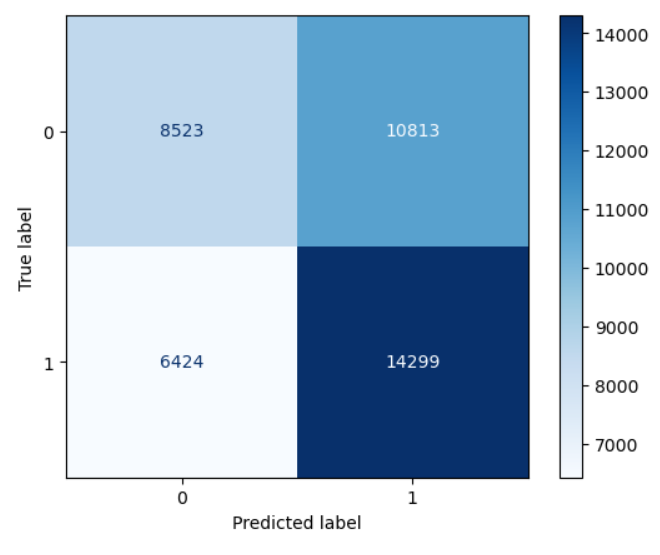

# Introduction

Age of Empires II is a popular RTS (real-time strategy) game, currently developed by Microsoft under World's Edge studios and the Forgotten Empires team. The ranked mode of the game pits you (and optionally your team) against another team, based on elo. Everyone picks a civilization before the match begins, which has unique bonuses and access to different units, with the goal of building an empire to defeat your opponent.  
In 2v2 games, players pick civilizations according to the map and in order to cover each others' weaknesses. This project aims to answer this question: **Is the winner of a 2v2 game already decided by just the civilizations, map, and elo of the players?** In other words, are matches usually "civ wins" where one team has the clear advantage, and are elo disparities strong enough to sway the game before any play has begun?  

### Data
First, a big thank you to jerbot from [aoestats.io](https://aoestats.io/) for creating a community API endpoint for access to the data. This analysis is only possible because of this!  
 
The initial dataset has data from the last 5 weeks of games, from 5/11/25 to 6/14/25. In total, there were _ games, with a total of _ player instances. The data is separated into one dataframe of information on games, and one with information on specific players.  
The dataset has many columns (you can read a full description [here](https://aoestats.io/)). From the match dataframe, I will use the following columns:  
- `map` - string: contains the map the game was played on.
- `game_id` - string: internal id of the game - used to merge with the player dataframe.
- `avg_elo` - float: average elo of players in the match.
- `team_0_elo` - float: average elo of one team (team 0) in the match.
- `team_1_elo` - float: average elo of the other team (team 1) in the match.
- `raw_match_type` - integer: contains an integer referring what mode the game was (1v1, 2v2, etc.)
- `duration` - timestamp: contains duration of the game.  
From the player dataframe, I will use the following:    
- `winner` - boolean: if the player won.
- `game_id` - string: used to merge with match dataframe.
- `team` - int: which team the player was on.
- `civ` - string: which civilization the player was playing.
- `old_rating` - float: player elo before the match was played.
All columns of the dataframes and more information can be found [here](https://aoestats.io/api-info/).  

# Data Cleaning and Exploratory Data Analysis

### Cleaning

This data was actually fairly clean. To start, I filtered to only contain 2v2 games, since that's the question I'm trying to answer.   
Then, I filtered out any games that lasted less than 2 minutes, since occasionally the servers or someones internet crash at the very beginning of the game, in which case the data is meaningless because the winner is random.  
Finally, there were a few games that were marked as 2v2 games but had 3 players, which there is no gamemode with that amount. So, I filtered those out.  
All told, this filtering reduced the number of 2v2 games from 169028 to 160234. All but 3 of those filtered out games were less than 2 minutes long likely due to disconnect.  
Then, I created three new columns. Two of them contained the civilization pairs for either team, sorted alphabetically. The other column was just a true/false for which team won the game. So, the final cleaned data looked like this:    

| map    |   game_id |   avg_elo |   team_0_elo |   team_1_elo |   raw_match_type | duration               | team0_civs         | team1_civs           |   winning_team |
|:-------|----------:|----------:|-------------:|-------------:|-----------------:|:-----------------------|:-------------------|:---------------------|---------------:|
| arabia | 398269888 |   1102.75 |       1084.5 |       1121   |                7 | 0 days 00:21:08.200000 | celts cumans       | armenians mongols    |              1 |
| nomad  | 398270650 |    961.5  |        954   |        969   |                7 | 0 days 00:32:02.700000 | koreans vikings    | dravidians saracens  |              0 |
| arabia | 398269639 |   1199    |       1189.5 |       1208.5 |                7 | 0 days 00:40:51.400000 | ethiopians wei     | magyars mongols      |              0 |
| arena  | 398269620 |   1051.5  |       1044.5 |       1058.5 |                7 | 0 days 00:47:25.800000 | franks khitans     | bohemians jurchens   |              1 |
| arabia | 398268971 |   1055.5  |       1021.5 |       1089.5 |                7 | 0 days 00:31:59.300000 | ethiopians teutons | italians lithuanians |              0 |

   

### Exploratory Analysis - Interesting Distributions and Statistics

The following bar chart shows the distribution of civilization picks across all 2v2 games in the dataset. Some civilizations have much lower pickrates than others, and a few stand out as very popular.  

<iframe
src="assets/civ_picks.html"
width="1100"
height="600"
frameborder="0"
></iframe>

The following heatmaps plot civilization combos to winrates. The first graph shows the winrates across all maps of civ combos, while the latter two are separated by map to show arabia and arena, respectively. For the map-specific heatmaps, I've filtered to only show civ combos with more than 30 occurences, since low sample size can skew winrates. So, any combo with winrate 0 is just very uncommon.

<iframe
src="assets/civ_combo_winrates.html"
width="1100"
height="1100"
frameborder="0"
></iframe>

<iframe
src="assets/arabia_civ_winrates.html"
width="1100"
height="1100"
frameborder="0"
></iframe>

<iframe
src="assets/arena_civ_winrates.html"
width="1100"
height="1100"
frameborder="0"
></iframe>

 
Another interesting statistic is which civilizations are most commonly played at which skill levels. The following (very long!) table shows the average rating of each civilization in our dataset of 2v2 games. You can see how some civilizations are more beginner-friendly/popular such as Teutons, which is typically viewed as a beginner civ, although there are a few surprises such as Romans being popular among beginners even though they aren't typically viewed as such.
 

| civ         |   old_rating |
|:------------|-------------:|
| armenians   |     1087.16  |
| aztecs      |     1032.4   |
| bengalis    |     1108.03  |
| berbers     |     1122.97  |
| bohemians   |     1009.61  |
| britons     |      990.996 |
| bulgarians  |     1029.07  |
| burgundians |     1002.23  |
| burmese     |     1107.56  |
| byzantines  |     1000.5   |
| celts       |     1004.18  |
| chinese     |      975.042 |
| cumans      |     1051.63  |
| dravidians  |     1127.34  |
| ethiopians  |     1097.5   |
| franks      |      983.58  |
| georgians   |     1093.91  |
| goths       |      983.313 |
| gurjaras    |     1068.26  |
| hindustanis |     1063.95  |
| huns        |     1013.33  |
| incas       |     1036.26  |
| italians    |     1088.59  |
| japanese    |     1038.26  |
| jurchens    |     1071.59  |
| khitans     |     1118.15  |
| khmer       |      977.947 |
| koreans     |     1090.71  |
| lithuanians |     1053.94  |
| magyars     |     1084.57  |
| malay       |     1082.16  |
| malians     |     1108.66  |
| mayans      |     1083.59  |
| mongols     |     1078.69  |
| persians    |     1037.56  |
| poles       |     1042.86  |
| portuguese  |     1001.95  |
| romans      |      984.262 |
| saracens    |     1111.37  |
| shu         |     1104.86  |
| sicilians   |     1005.5   |
| slavs       |     1028.87  |
| spanish     |     1055.25  |
| tatars      |     1065.39  |
| teutons     |      977.374 |
| turks       |      994.167 |
| vietnamese  |     1041.94  |
| vikings     |     1036.67  |
| wei         |     1072.68  |
| wu          |     1124.78  |

 

# The Problem

This project aims to predict the winner of a 2v2 Age of Empires II game. In terms of the data, I aim to predict the `winning_team` column using information available at the start of the match to see whether or not we can accurately predict the winner based off of only civilization, map, and elo data. Specifically, I will use the civilizations both teams are playing, the map they played on, the average elo of the whole match, and the average elo of each team. Since this is a prediction problem, I won't use any data from after the match is over (such as match duration) - although that would be interesting analysis! 
This is a **binary classification** problem, since we are predicting either 0 (team 1 lost) or 1 (team 1 won). I'll be analyzing the model's effectiveness using accuracy, since for this problem we aren't too concerned with whether our mistakes were false negatives or false positives, just if the model correctly predicted.  

# First/Baseline Model

My initial model just took in the civilizations of each team and the average elo of each team, and used logistic regression to predict the winner. For the civilizations, I one-hot encoded each combination, and grouped all infrequent occurences (arbitrarily chose 5 as the minimum frequency). For the average elos of each team, I created a polynomial of degree 1 - again arbitrarily chosen degree. So, this model took in four total columns from the dataframe, two corresponding to elo and two to civilizations.  
The testing accuracy of this initial model was 56.97%. For not knowing anything other than the civilizations and elo (it should be noted the average elo difference between teams in the dataset was ~30 points on a scale ranging from 0 to 2000+), this model is a good starting point.  
The model used the default regularization built into the logistic regression model from sklearn. Additionally, the model's training accuracy was 59.61%, which is not too different from the testing accuracy, so the model is not too overfit to the data, likely thanks to regularization.  
Overall, this is a fairly good starting model, but can definitely be improved upon.

# Final Model

For the final model, I added the following features:  
- `map`: Added one-hot encoded map data - should help with accuracy since knowing which map the game is on should favor some civ combos over others.
- `avg_elo`: Added the average elo of the game. This should help since certain civilizations are much better than others when in the hands of better players, and much worse in the hands of worse players.  
And, I engineered the following features:  
- `elo_diff`: Difference between the elos of the two teams. This should mostly help with edge cases where matchmaking put one team that was much better vs one that was much worse, and should help in general.
- Interaction terms: Polynomial interaction term that models interaction between existing variables. More on this later.  
I chose to keep using `LogisticRegression`, although I experimented with `RandomForestClassifier` and `XGBClassifier`. I didn't use the latter due to hardware limitations, and the prior since it's accuracy was either worse or equivalent.  
I used `GridSearchCV` to find ideal model parameters. It chose the following:  
- `min_frequency = 3`: So for a civ combo to be considered frequent, it only needed 3 games.
- `degree = 1`, for both polynomials (average elo and elo difference). `GridSearchCV` chose degree 1. Unfortunately I couldn't tune the interaction term parameter, again due to hardware limitations, so I set that degree to 1 as well.
- `C = 0.01`: C is the inverse regularization parameter for `LogisticRegression`. In other words, a moderate penalty was chosen.  
All that aside, how did the model improve? The final models confusion matrix was:  
